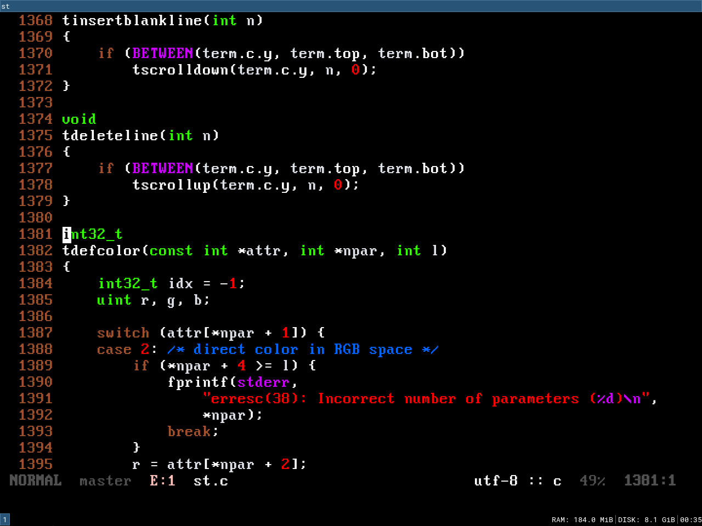
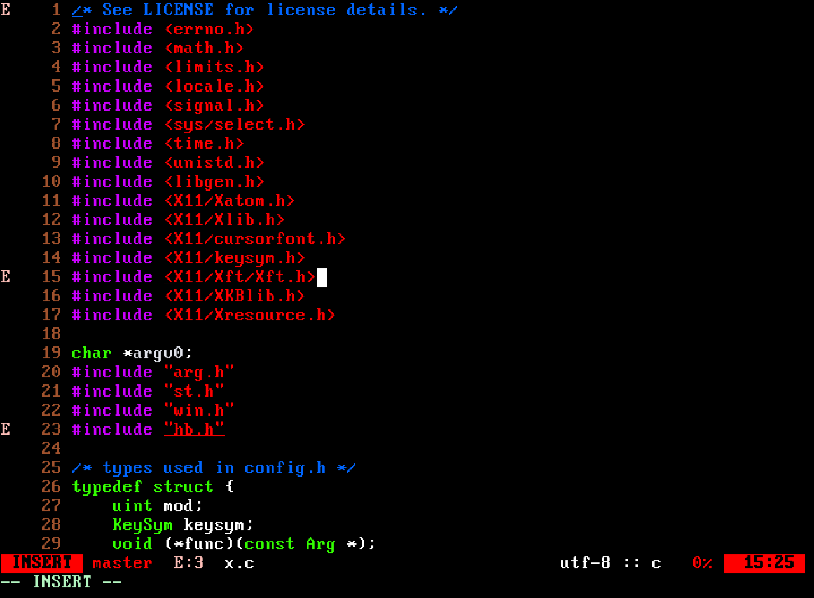

# Devel.nvim

A dark Neovim colorscheme for devels




## Installation (lazy.nvim)

```lua
{
  "makestatic/devel.nvim",
  lazy = false,
  priority = 1000,
  config = function()
    vim.cmd("colorscheme devel")
  end
}
```


## License

MIT © 2025 [makestatic](https://github.com/makestatic)
